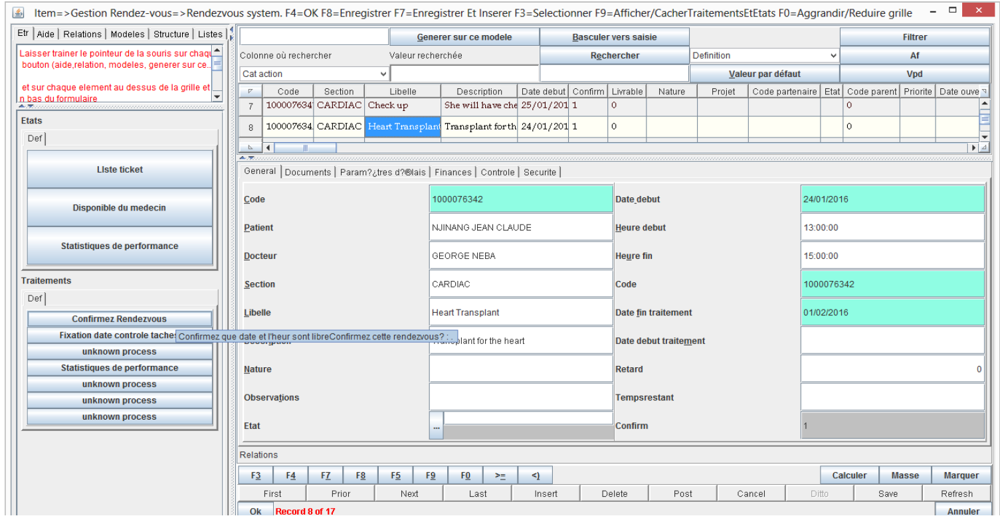

# Hospital Appointment Scheduler System

This report describes the work conducted during a five month internship at Megasoft SARL which was divided into 2 parts; Training and Problem solving. 

Training, which required me to learn the organization’s project documentation style and how to use the organization’s framework, MDAL (Megasoft Data Access Library). This framework is a tool that aids in code organization, rapid development of applications and provides code libraries.  
A hospital stay is often an unpleasant experience for a patient. Long waiting hours for previously booked appointments as well as delays in diagnosis and treatment are among the most common sources of frustration. This was the problem I was assigned to solve. This report therefore presents a hospital appointment scheduler system (HASS) which I developed to overcome this problem. A website and a desktop application were successfully developed using Java, Javascript, Html and CSS. Hence, using this system, patients can now book appointments at their own convenience, according to their own schedule and with a doctor of their own choosing. HASS is therefore a system that lies at the intersection of healthcare delivery and technology. 

All applications were built in Java

## Web Application

The steps in the web application can be seen below:

------------------------------

Some Screenshots from the Web App

|  Patient login in HASS web  |  Patient Selects Appointment in HASS web |  Patient Fills Appointment Details in HASS(web) |
|:---:|:---:|:---:|
|  Patient Views Doctor's Monthly Schedule  |  Patient Views Doctor's Weekly Schedule|  Doctor Views All Patients Who Book Appointment on HASS Web |

------------------------------------------------------------------------

## Desktop Application

The Steps that can be taken in the Desktop application are:

-----------------------------------------

Some Screenshots from the Desktop App

|  Doctor Logs in and Selects Appointment |  Doctor Confrims Particular Patients Appointment|
|:---:|:---:|:---:|
